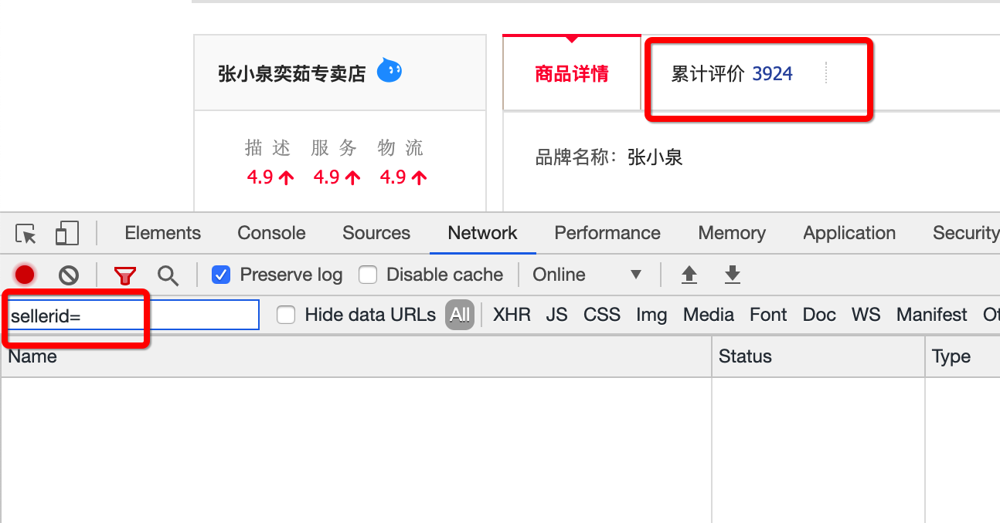
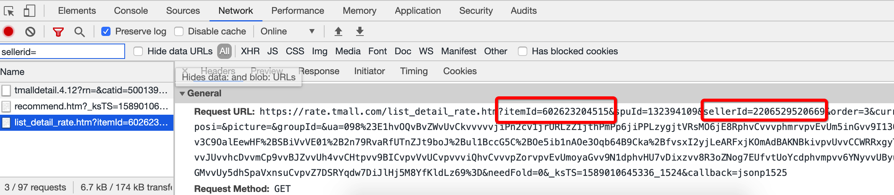
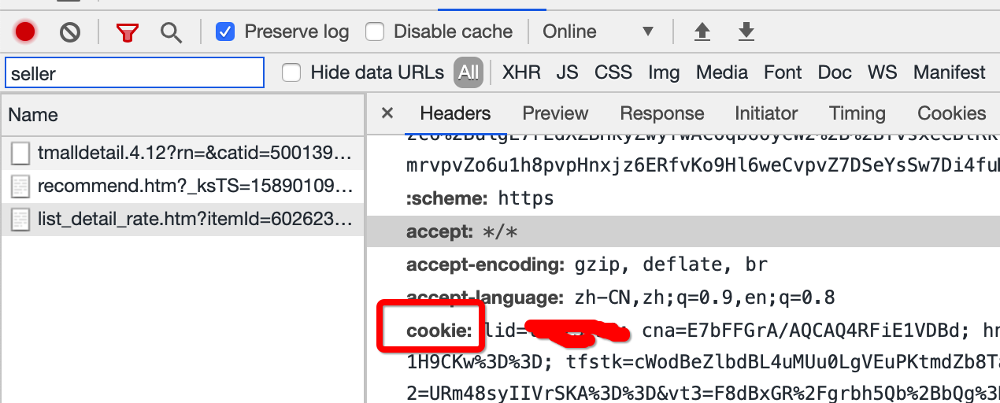

# Taobao_Comment
淘宝商品评论抓取并生成词云

## 使用方法

```sh
python3 taobao.py itemId sellerId
```

其中 itemId 为商品 ID；sellerId 为店铺 ID；这两个 ID 缺一不可

itemId 和 sellerId 需要自己到淘宝的商品页面用浏览器工具抓取

具体的抓取方法如下，打开淘宝商品页面，如[这个页面](https://detail.tmall.com/item.htm?id=602623204515&ali_refid=a3_430582_1006:1252700148:N:LZBz7CFDX764HvM1ZxL7TQ==:e7dd1540836835ff5cd6d33d48fcbd54&ali_trackid=1_e7dd1540836835ff5cd6d33d48fcbd54&spm=a230r.1.14.1)，打开开发者工具（谷歌浏览器是使用 cmd+option+i），切到 Network 页卡，清空所有请求信息。

接着在输入框输入 "sellerId="，随后点击累计评论，此时会发出请求评论的请求，我们在过滤后的结果中查看，获取对应的 itemId 和 sellerId 即可




还有同时请拷贝好自己的 Cookie 备用，用来修改脚本中 YourCookie 字段




## 测试例子
```sh
python3 taobao.py 603314107202 2064852052
```

## 注意事项
本脚本内置了我自己假的 Cookie，是无效的，你需要改为自己的

你需要登录到具体的商品页面之后，通过浏览器工具获取自己的 Cookie，并替换脚本中的 YourCookie 字段；Cookie 失效的时候也需要重新这样获取

如果淘宝检测出你是机器人也会导致脚本失败，此时浏览器打开商品页面后会有一个验证机器人的过程，验证好 Cookie 就又可以用